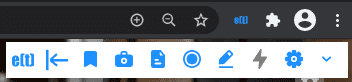
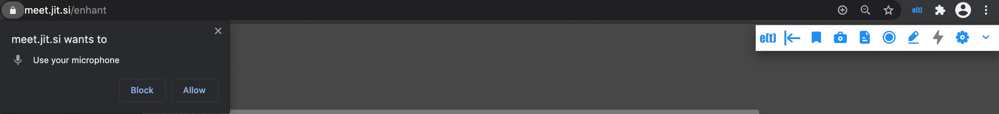
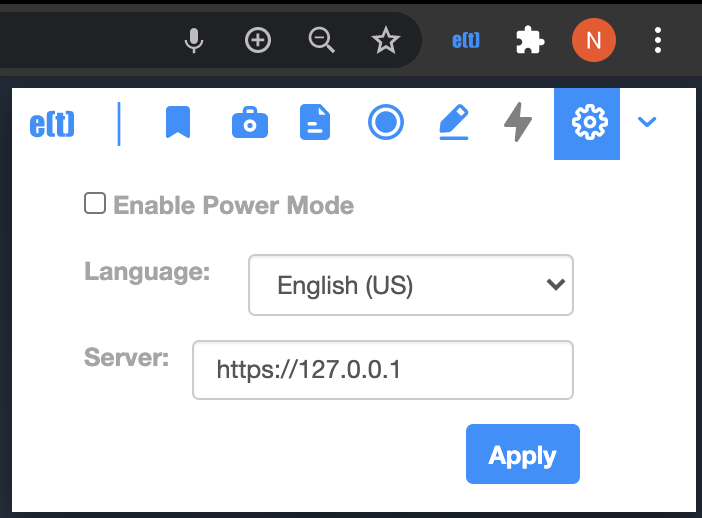

.. _basic_mode:

Basic Mode
=============================================

This is the minimal mode which can run just by installing the extension. For installation instructions, see :ref:`installing_chrome_extension` or :ref:`installing_firefox_addon`.

Once the enhan(t) extension is installed, and you open a Zoom, MS Teams or Jitsi web meeting on the browser, the enhan(t) toolbar would show up.

  enhan(t) extension - Basic mode toolbar

If the extension has just been installed for the first time, it would also ask for microphone permission, which needs to be allowed so that the meeting can be transcribed.

  enhan(t) extension - Permissions

For Basic mode users, you can leave the 'Enable Power Mode' settings unchecked.

  Basic mode setting - 'Enable Power Mode' unchecked

If you want to change the transcription language setting for the host side (via microphone), you can select English (US) or English (IN) from the drop down. Hit 'Apply' to save the changes.

Once the meeting has been joined, the record icon can be hit to start the enhan(t) session. The record icon will keep animating during the course of the session. The toolbar will expand to show 3 new icons – bookmark, camera and file. These icons provide the following functions:

#.  Bookmark moment (bookmark icon): This allows the user to literally bookmark a moment during the meeting. A lot of times, one wants to mark a moment which seems important so that one can go back later and refer to it. This enables this feature.
#.  Capture screenshot (camera icon): This allows the user to capture the contents displayed in the tab along with the timestamp. This allows the user to captured shared screen content, like that important slide during a presentation, along with the time.
#.  Take notes (file icon): On clicking this, the user is provided with a text area where one can take notes. The user can also record notes using voice by clicking on the mic icon (speak now) in the notes section. On clicking the ‘Add Notes’ button, the notes are persisted along with the timestamp. Users at times want to add their thoughts during the meeting. This feature enables that.

At any point in time, user can click the rightmost chevron icon to toggle the expansion and collapse the history of actions during the meeting. The latest action appears at the top.

.. raw:: html

   <video width="600" height="auto" controls>
      <source src="../_static/getting_started_in_2_mins.mp4" type="video/mp4">
      Your browser does not support the video tag.
   </video>

The user can end the enhan(t) session by hitting the animated record icon. Once that is done, a zip file is generated which would contain all the captured meeting data. This can be unzipped and then the user can view the plain text data and images. Alternatively, one can go to the `enhan(t) Meeting Data Viewer <https://keplerlab.github.io/enhant-dashboard-viewer/>`_ and view the details of the meeting there.

**For firefox - the downloaded file is of the format a5sZQRsx.zip.part. This is due to a bug in firefox** `367231 <https://bugzilla.mozilla.org/show_bug.cgi?id=367231>`__ . **Remove the .part from the downloaded file and use the zip file as it is to visualize data.**
