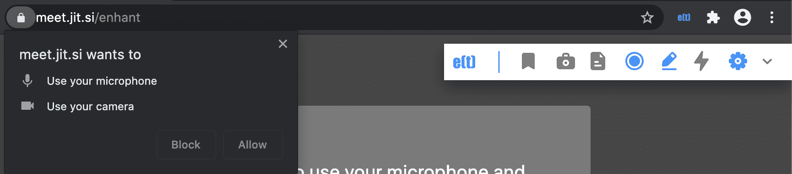

.. _basic_mode:

Basic Mode
=============================================

This is the minimal mode which can run just by installing the Chrome extension. For installation instructions, see :ref:`installing_chrome_extension`.

Once the enhan(t) extension is installed, and you open a Zoom, MS Teams or Jitsi web meeting on the browser, the enhan(t) toolbar would show up.

.. figure:: ../images/basic_mode_toolbar.png
  :width: 70%
  :alt: enhan(t) Chrome extension - Basic mode toolbar
  :align: center

  enhan(t) Chrome extension - Basic mode toolbar

If the extension has just been installed for the first time, it would also ask for microphone permission, which needs to be allowed so that the meeting can be transcribed.

  enhan(t) Chrome extension - Permissions

Once the meeting has been joined, the record icon can be hit to start the enhan(t) session. The record icon will keep animating during the course of the session. The toolbar will expand to show 3 new icons – bookmark, camera and file. These icons provide the following functions:

.. raw:: html

   <video width="600" height="auto" controls>
      <source src="../_videos/getting_started_in_2_mins.mp4" type="video/mp4">
      Your browser does not support the video tag.
   </video>

#.  Bookmark moment (bookmark icon): This allows the user to literally bookmark a moment during the meeting. A lot of times, one wants to mark a moment which seems important so that one can go back later and refer to it. This enables this feature. Apart from noting the timestamp, it also captures the transcription of the last 10 seconds of host side (via microphone).
#.  Capture screenshot (camera icon): This allows the user to capture the contents displayed in the tab along with the timestamp. This allows the user to captured shared screen content, like that important slide during a presentation, along with the time.
#.  Take notes (file icon): On clicking this, the user is provided with a text area where one can take notes. On clicking the ‘Add Notes’ button, the notes are persisted along with the timestamp. Users at times want to add their thoughts during the meeting. This feature enables that.

At any point in time, user can click the rightmost chevron icon to toggle the expansion and collapse the history of actions during the meeting. The latest action appears at the top.

The user can end the enhan(t) session by hitting the animated record icon. Once that is done, a zip file is generated which would contain all the captured meeting data. This can be unzipped and then the user can view the plain text data and images. Alternatively, one can go to the `enhan(t) Meeting Data Viewer <https://keplerlab.github.io/enhant-dashboard-viewer/>`_ and view the details of the meeting there.
