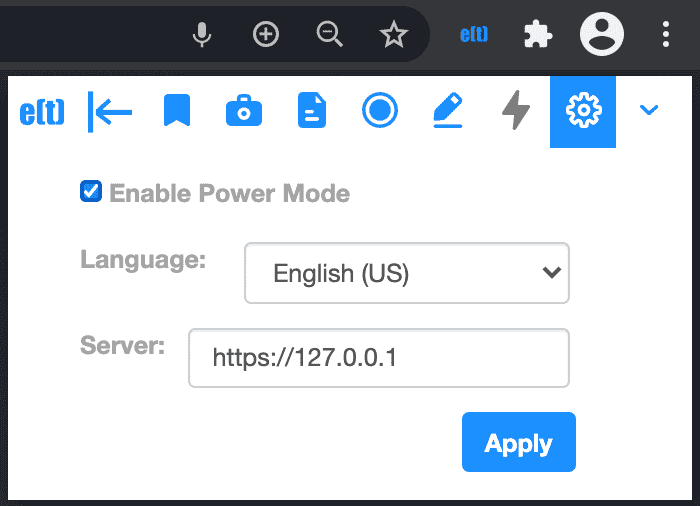

.. _power_mode:

Power Mode
================

**Note : Power mode is unavailable on firefox because of lack of support for capturing tab audio.**

This mode of the extension gives additional functionalities to power users when used in conjunction with the companion transcription service. For installation of the transcription service, please refer to :ref:`installing_transcription_service_and_cli`.

Once the transcription service is installed and run, one can click the settings icon in the extension toolbar, check ‘Enable Power Mode’ and hit ‘Apply’ to activate the Power mode.

  Power mode setting - 'Enable Power Mode' checked

A lightning icon will now appear in the toolbar, signifying that the Power mode is active.

.. figure:: ../images/power_mode_toolbar_v2.png
  :width: 70%
  :alt: enhan(t) Chrome extension - Power mode icon active in the toolbar
  :align: center
  
  Power mode icon active in the toolbar

If you want to change the transcription language setting for the host side (via microphone) and guest side (via tab audio), you can select English (US) or English (IN) from the drop down. Hit 'Apply' to save the changes. English (IN) would be used only if the Google Cloud Speech to Text transcription service is run in the background.

For advanced developers, who want to change ports during local deployment or host the Docker application remotely, the ‘Server’ textbox can be used to input the URL. Hit ‘Apply’ to persist the changes.

All other features work as is in the Basic mode. The difference is that now both host (via microphone) and guest (via tab audio) side of the conversation are transcribed in real time.

The meeting zip file generated in Power mode can be further analyzed by using the Analysis CLI application and viewed at the `enhan(t) Meeting Data Viewer <https://keplerlab.github.io/enhant-dashboard-viewer/>`_ for further details.
