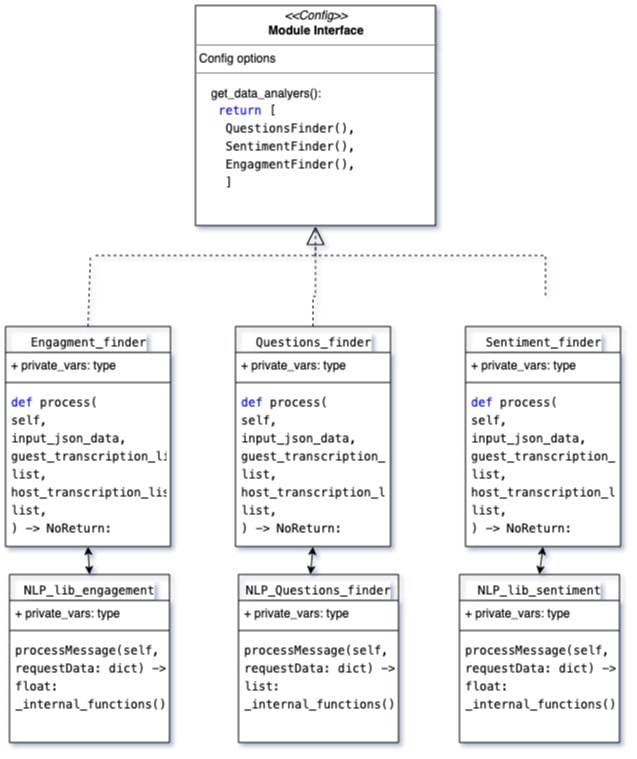

How to add or subtract NLP analyzer
===================================

**Architecture NLP analyzer**

Take a look at above figure NLP Analyser Architecture
cli app has one config module on which we can dynamically load
all the nlp analyzers we want to run on our input data.
Currently cli app takes input.json as input and writes back result in
processed.json, each of the NLP analyzers needs to follow this same syntax
that each needs to take input.json as well as host and guest srt files as input
writes back results in processed json.
In our current implementation these functions are Engagement_finder, Questions_finder, Sentiment_finder respectively.
As we want to decouple our application related interface (e.g. here input.json, guest.srt and host.srt) operations from core  nlp operations, we have made a core nlp logic as an nlp lib which has their own common interface, for our current implementation, these are located in NLP_lib_engagement, NLP_Questions_finder, NLP_lib_sentiment respectively.

As shown in diagram all of the NLP analyzers need to follow common
interface which so if you need to add a additional nlp analyzers
you need to implement same interface standard public interface. Which is ::

   def process(
   self,
   input_json_data,
   guest_transcription_list: list,
   host_transcription_list: list,
   ) -> NoReturn:

This process function can call any of your own pre-processing logic, you can also create a
new module implemented inside nlp_lib.

After implementing your own nlp analyser you can import it's module inside
cli/config.py file and add instance of your module class inside get_data_analyers()
function.

Similarly if you need to remove any of the existing nlp analyzers you just need to remove
their respective instance from get_data_analyers function in cli/config
