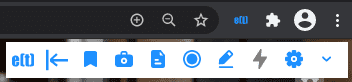

.. _installing_chrome_extension:

Installing the Chrome Extension
===============================

The Chrome extension is the minimal requirement for most users to leverage enhan(t). The easiest way to install it is via the Chrome store.

To install the enhan(t) extension:

#.  Navigate to Chrome Webstore `enhan(t) Note Taking Power Tool <https://chrome.google.com/webstore/detail/enhant-meeting-power-tool/fohcdemnkddkfcbheibnjhnpfliemnfg>`__ page via your Chrome browser.
#.  Click the ‘Add to Chrome’ button. You would be able to see the enhan(t) icon in your toolbar.
#.  When you open a Zoom, MS Teams or Jitsi meeting, you will find the enhan(t) toolbar on the top right of your tab.

  enhan(t) Chrome extension toolbar on the top right of your tab

.. _installing_firefox_addon:

Installing the Firefox Add-on
===============================

The firefox add-on is the minimal requirement for most users to leverage enhan(t). The easiest way to install it is via the firefox add-on store.

To install the enhan(t) extension:

#.  Navigate to Firefox add-ons store `enhan(t) Note Taking Power Tool <https://addons.mozilla.org/en-US/firefox/addon/enhan-t-note-taking-power-tool/>`__ page via your firefox browser.
#.  Click the ‘Add’ button. You would be able to see the enhan(t) icon in your toolbar.
#.  When you open a Zoom, MS Teams or Jitsi meeting, you will find the enhan(t) toolbar on the top right of your tab.

  enhan(t) add-on toolbar on the top right of your tab

.. _installing_transcription_service_and_cli:

Installing the Transcription Service and Analysis CLI (Command Line Interface)
==============================================================================

The transcription service and analysis CLI enables the Power mode in the Chrome extension to work. It enables guest side transcription, provides engagement, sentiment and interrogatives.

**Note : Power mode is unavailable on firefox because of lack of support for capturing tab audio.**

The transcription service and the analysis CLI can be installed as a Docker compose application.
To install both as application using docker application follow these instructions:

#.  Make sure you have Docker installed on your system. If not, go to https://docs.docker.com/get-docker/ and follow the instructions there to get started with Docker.

#.  Make sure you have Git installed. If not, go to https://www.atlassian.com/git/tutorials/install-git and follow the instructions there.

#.  You can find the enhan(t) project on Github at https://github.com/keplerlab/enhant. Clone the repository by running the following git clone command on your terminal::

        git clone https://github.com/keplerlab/enhant.git

    On **Windows** to prevent line ending issues clone using this command instead::

        git clone  https://github.com/keplerlab/enhant.git --config core.autocrlf=false

#.  Next, to have locally trusted development certificates we need to install mkcert. Please follow the installation instructions :ref:`certificate_for_localhost` for detailed instructions
#.  Now go to the cloned ‘enhant’ directory and then run go to certificates directory.::

        $ cd certificates-and-credentials

#.  Run following to create the certificates.::

        $ mkcert -key-file key.pem -cert-file cert.pem localhost 127.0.0.1 ::1

#.  Change your directory to your cloned repo.

#.  Start Docker containers::

        cd /path/to/enhant-repo/
        docker-compose up

#.  To Stop Docker containers, Open terminal and run the following commands::

        cd <path-to-repo> //you need to be in your repo folder
        docker-compose down

You can also use Google Cloud Speech for Text for transcription service as an alternative.
In most of the cases this results in better transcription accuracy. 
For this please read the guide :ref:`use_google_cloud_for_speech_to_text_cli`. 

Supported Hardware and operating system
========================================

enhant software is supported on the following host operating systems:

* Linux
* mac OS X
* Windows 

**Minimum Docker configuration.**:

* Processor: 2 cpu cores
* RAM: 4GB of system memory
* Hard disk space: 20 GB
* Google Chrome or chromium browser
* Firefox browser version >= 80

**Recommended system configuration**:

* Processor: 4 cpu cores
* RAM: 6GB of system memory
* Hard disk space: 30 GB
* Google Chrome or chromium browser
* Firefox browser version >= 80
