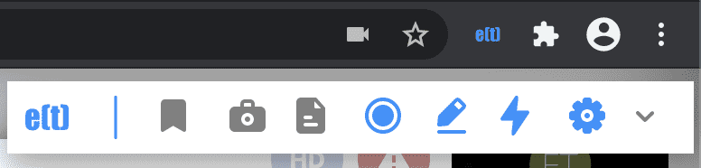

Parts of enhan(t)
=================

-  Chrome extension [required]

-  Transcription Service [optional]

-  Analysis CLI (Command Line Interface) [optional]

-  enhan(t) meeting data viewer [optional]

Chrome Extension
----------------

Then enhan(t) Chrome extension is the minimum requirement to get started
with enhan(t) in a meaningful way. It allows basic users to enhance the
meetings conducted in Zoom, MS Teams or Jitsi on the Chrome browser. It
enables users to bookmark moments (capture the timestamp of the moment
along with the last <few> seconds of host side transcription), capture
screenshots (take the screenshot of the visible tab area along with the
timestamp), take notes (take manual notes along with timestamp) and
transcript the host side of the conversation (from the microphone) after
hitting the record icon. On ending the enhan(t) session, the user is
provided with a zip download, containing all the data captured. This
data can be viewed as plan text after extracting the zip download or can
be viewed in the enhan(t) data viewer.

  enhan(t) Chrome extension - Basic mode toolbar

The extension can provide more data if used in Power mode alongside the
companion transcription service. Once the setup is done, Docker
application run and the Power mode is enabled in the extension settings,
the extension will now be able to transcript both the host side (via
microphone) and guest side (via tab audio) of the conversation.
Bookmarking moment would come along with the transcription of the last
<few> seconds of both side of the conversation. Additionally, meeting
metrics like engagement and sentiment is also provided. Post the call,
all the questions asked during the meeting can be extracted via
interrogative analysis.

  
  enhan(t) Chrome extension - Power mode toolbar

Transcription Service
---------------------

The transcription service enables the speech to text conversion for the
guest side conversations in the Power mode of the Chrome extension.

The transcription service uses an open source speech recognition toolkit
called Vosk (https://alphacephei.com/vosk/) for speech to text
conversion by default. Alternatively, Google Cloud Speech to Text
service could be used.

Analysis CLI (Command Line Interface)
-------------------------------------

The analysis CLI enables the generation of meeting metrics like
engagement and sentiment in the Power mode. The zip file generated in
the power mode can be provided to the analysis CLI service to generate
an output zip file which would have engagement and sentiment metrics.

enhan(t) Meeting Data Viewer
----------------------------

The enhan(t) Meeting Data Viewer where a user can view a downloaded
meeting data zip file in context.

Once a basic mode meeting data zip file is loaded locally, the user can
view the following details along with the time:

-  Meeting duration

-  Bookmarks

-  Screenshots

-  Notes

-  Audio or video recording overlayed with bookmarks, screenshots and
   notes moments (if user uploads them)

.. figure:: ./images/meeting_data_viewer_basic_mode.png
  :width: 70%
  :alt: enhan(t) Meeting Data Viewer - Basic mode
  :align: center
  
  enhan(t) Meeting Data Viewer - Basic mode

If a power mode meeting data zip file is loaded, along with the basic
mode details, one can also view:

-  Average engagement

-  Average sentiment

-  Sentiment and engagement overlay graph on the audio or video
   recording

-  Sentiment outliers

-  Extracted interrogatives
