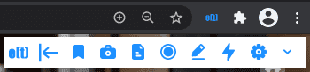

Parts of enhan(t)
=================

-  Browser Extension (for chrome & firefox) [required]

-  Transcription Service [optional]

-  Analysis CLI (Command Line Interface) [optional]

-  enhan(t) meeting data viewer [optional]

Browser Extension
------------------

Then enhan(t) extension is the minimum requirement to get started
with enhan(t) in a meaningful way. It allows basic users to enhance the
meetings conducted in Zoom, MS Teams or Jitsi on the Chrome & firefox browser. It
enables users to bookmark moments, capture screenshots (take the screenshot 
of the visible tab area along with the timestamp), 
take notes (take manual notes by hand-typing it or using voice along with timestamp). 
On ending the enhan(t) session, the user is
provided with a zip download, containing all the data captured. This
data can be viewed as plan text after extracting the zip download or can
be viewed in the enhan(t) data viewer.

.. figure:: ./images/basic_mode_toolbar_v2.png
  :width: 70%
  :alt: enhan(t) extension - Basic mode toolbar
  :align: center

  enhan(t) extension - Basic mode toolbar

The annotation tools in the extension can be used during presentations
to convey ones point across in a better way. It can also be used for
reference by taking a screenshot. By providing an ability to draw over,
highlighting content and adding text over a page, one can enrich meeting
experiences and add flavor to learning experiences, just to name two use
cases.

The extension can provide more data if used in Power mode alongside the
companion transcription service. Once the setup is done, Docker
application run and the Power mode is enabled in the extension settings,
the extension will now be able to transcript both the host side (via
microphone) and guest side (via tab audio) of the conversation. 
Additionally, meeting metrics like engagement and sentiment is also provided. 
Post the call, all the questions asked during the meeting can be extracted via
interrogative analysis.

  
  enhan(t) extension - Power mode toolbar

**Note : Power mode is unavailable on firefox because of lack of support for capturing tab audio.**

|

Transcription Service
---------------------

The transcription service enables the speech to text conversion for the
guest side conversations in the Power mode of the Chrome extension.

The transcription service uses an open source speech recognition toolkit
called Vosk (https://alphacephei.com/vosk/) for speech to text conversion by default..
One drawback of using  kaldi-vosk speech recognition is that transcribed
text do not have any punctuations. To add punctuations to the text we use 
`fastpunct <https://github.com/notAI-tech/fastPunct>`_ library for adding punctuations
to the text. You can also use Google Cloud Speech to Text for transcription service as an alternative.
For this please read the guide :ref:`use_google_cloud_for_speech_to_text_cli`. 

Analysis CLI (Command Line Interface)
-------------------------------------

The analysis CLI enables the generation of meeting metrics like
engagement and sentiment in the Power mode. The zip file generated in
the power mode can be provided to the analysis CLI service to generate
an output zip file which would have engagement and sentiment metrics.
If you want to read more about current NLP analyzers avalible in enhant CLI,
you can read more :ref:`current-nlp-analyzers`.

enhan(t) Data Viewer
----------------------------

The enhan(t) Data Viewer where a user can view a downloaded
meeting data zip file in context.

Once a basic mode data zip file is loaded locally, the user can
view the following details along with the time:

-  Meeting duration

-  Bookmarks

-  Screenshots : Full page or selected area.

-  Notes: Using Voice or manually.

-  Audio or video recording overlayed with bookmarks, screenshots and
   notes moments (if user uploads them)

  
  enhan(t) Data Viewer - Basic mode

If a power mode meeting data zip file is loaded, along with the basic
mode details, one can also view:

-  Average engagement

-  Average sentiment

-  Sentiment and engagement overlay graph on the audio or video
   recording

-  Sentiment outliers

-  Extracted interrogatives
