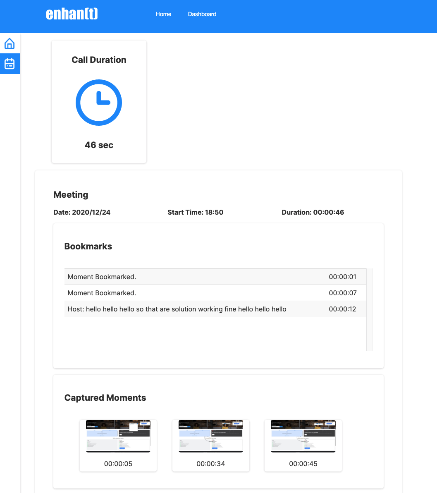
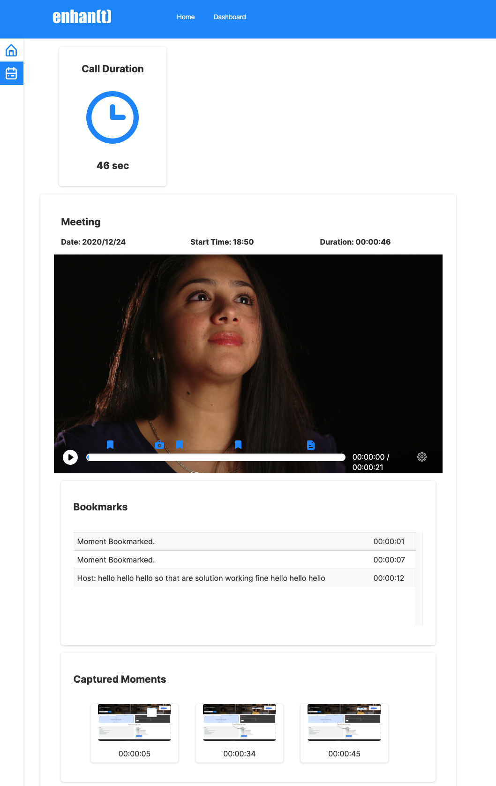
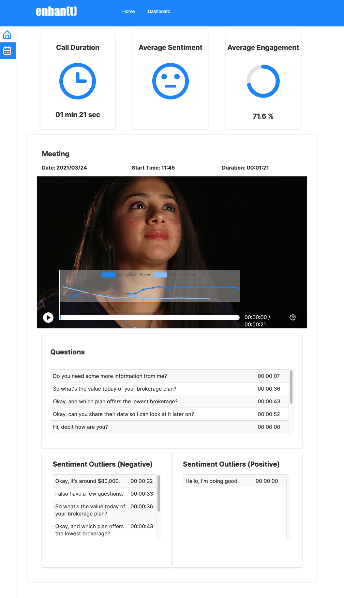

.. _using_enhant_in_meetings:

Using enhan(t) in Meetings
=============================================

enhan(t) can be used to collect notes while you are in a meeting. 

When in basic mode, enhan(t) will collect all data in a .zip file (downloaded when the recording is stopped). 
The zip file contains the following:

1. **host.srt** : 
A subtitle file containing the transcription data of the host.

2. **images** : 
Folder containing all the images captured using enhan(t).

3. **notes.pdf** : 
The contains all the data captured via enhan(t) and in the order it was captured w.r.t time. The pdf file can
be shared with others as part of meeting notes.

4. **notes.txt** : 
This is a raw text file containing the meeting data. It contains relative path to the image
inside the images folder. The txt file is plain raw data for developers to consume it in other applications based
on their need

5. **notes.md** : 
Markdown is a standard in lot of note-taking applications and platforms. Users can visualize the
notes in either Visual Studio Code or a note-taking app such as Evernote / Joplin. These platforms support Markdown
import so you can collect notes via enhan(t) and then import it inside a note-taking app.

When in power mode, enhan(t) will also transcribe the audio data for guest (speakers on the other side of the call).
This transcription is available in a separate **guest.srt** file inside the zip. When run in conjuction with
the analysis CLI, users will also get engagement and sentimentent scores, as well as, the outliers (both negative and positive)
during the meeting.

For more details on using the power mode, refer the guide :ref:`power_mode`.: 

Lets look at some scenarios in which the data from enhan(t) can be consumed:

1. Use enhan(t) visualizer: enhan(t) comes with out-of-the box visualizer, details here :ref:`viewing_meeting_data`: .
This is a web based visualization tool that works only with enhan(t) zip files. The zip data donwloaded using the
enhan(t) extension can be uploaded here, with an optional meeting recording.

Visualization for sample data (without meeting recording):

  enhan(t) visual tool - without meeting recording

In case, the meeting recording is available, which by default all major video conferencing platforms provide, upload the recording
to contextualize the data w.r.t meeting. In this scenario, the video pprogress bar will be overlayed
with information regarding notes captures. This help users mark important moments in the meeting.

Visualization for sample data (with meeting recording):

  enhan(t) visual tool - with meeting recording

With meetings, power mode is extremely useful for extracting information such as
sentiment score, engagement score, questions asked and outliers. Below is the visualization
for sample data when using power mode and analysis CLI.

Visualization for sample data in power mode (with meeting recording):

  enhan(t) visual tool - power mode

In the image above real time engagement and sentiment graphs can be seen on video
timeline. In addition, you also see questions asked during meeting and outliers.
